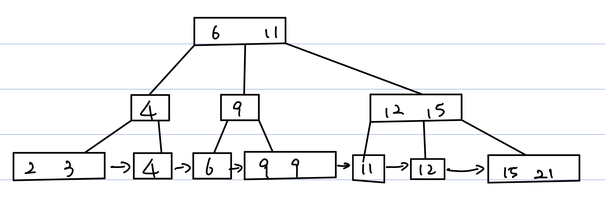
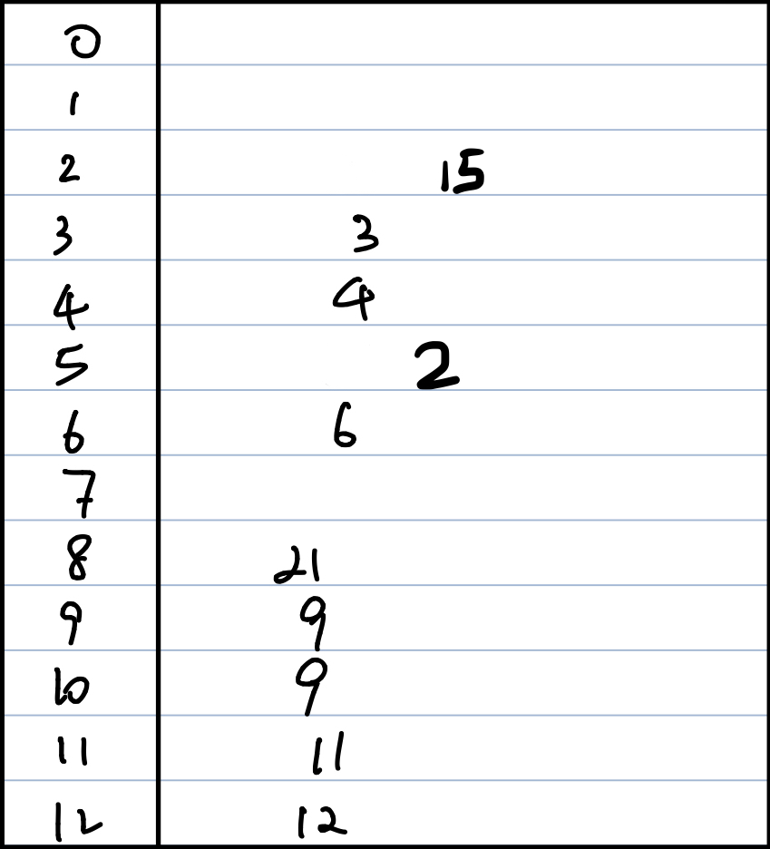

# Problem 1

 Store the data on a redundant array of independent disks (RAID).

 Since the data is written intensive, we should store them in two physical disks, the data can be read from both disks which improves performance.

 If one disk failed, we can use the other disk to recover the lost data.

# Problem 2

* DBMS provides better performance by storing data in a structural format and provides queries to access the data. OS access data via command line or interactive GUI. Therefore access the exact data via queries is faster than OS.

* The information DBMS uses to store the data and the corresponding table to be accessed along with additional data which user might want to provide to get extra info.

* Each table consists of data relevant to the domain of that table and the database in which that table is present.
  When accessing data within one or more table, the usage of JOIN and VIEWS can be very efficient and convenient.

* One example would be when searching for someone's phone number and address.

  In DBMS, user would only need to query with `SELECT phone and address FROM TABLE WHERE LASTNAME = "aaa" and FIRSTNAME = "bbb"`

  In OS, user would have to go to the specific folder, file and search, which would slower down the search speed.

# Problem 3

* CHS - It is a disk addressing method using a vertical coordinate head, a horizontal coordinate cylinder and an angular coordinate sector Head indicate the platter and cylinder indicate the track sector select which data block on the track. It identify individual sector on a disk by their position on the track.

* LBA - This scheme linearly maps the drive until the final physical sector is reached.

* LBA is more common because it covers the details of disk hardware so OS software don't need to worry about that. And the LBA can be mapped to CHS by the drive controller.

* CHS tuples can be mapped to LBA address with the following formula: `LBA = (C × HPC + H) × SPT + (S − 1)`

# Problem 4

  If the allocation of related records to blocks, it can reduce the number of disk accesses when queries on these records are executed.

  Since for the most of the time, disk accesses can be the bottlenecks in database accessing, the above technique can significantly improve the speed.

# Problem 5

| Tables        | Fixed Length Record | Variable Length Record |
| ------------- |:-------------------:|:----------------------:|
| Advantage     | Easy allocation and deallocation | Use only as much storage as it needed |
| Advantage     | Easy Searching      | Capable of accomodate unusual data that are not originally planned |
| | | |
| Disadvantage  | Not flexible      | Difficult to insert,  delete and search |
| Disadvantage  | Hard to change a field length | Cannot simply map to a C struct |

# Problem 6



# Problem 7



# Problem 8

It is preferred to use dense index when files are not sorted on the index fields or the index size is small when compare to the size of memory.

# Problem 9

* Every index requires extra CPU time and overhead during insertion and deletion.

* Extra index needs extra storage space.

* Index on non-primary keys might change during updates, but people usually won't change primary keys.

# Problem 10

* Use Case 1:  A user wants to be able find a customer(s) by country region; country region and state_province; country_region, state_province, city; just by city:

``` SQL
CREATE INDEX index1
	ON `customers` (country_region, state_province, city);
CREATE INDEX index2
	ON `customers` (city);
```

* Use Case 2: A user want to be able to do join on column country_region:

```SQL
CREATE INDEX index3
	ON `customers` (country_region);
```

* Use Case 3: A user want to be able to find a customer by fax_number:

```SQL
CREATE INDEX index4
	ON `customers` (fax_number);
```

* Use Case 4: A user want to use where and join on city frequently:

```SQL
CREATE CLUSTERED INDEX
	ON `customers` (city);
```

* Use Case 5: A user want to avoid the overhead of using clustered index on address:

```SQL
CREATE NONCLUSTERED INDEX
	ON `customers` (address);
```

# Problem 11

* Step 1: Partition R using h(i) = i % 5

|  Buffer Pool  |
| -------------:|
|  |
|  |
|  |
|  |

|  Files  ||||||
| -------:| -------:| -------:|-------:| -------:| -------:|
| R|(1,R)(2,R)(3,R)|(4,R)(5,R)(6,R)|(7,R)(8,R)(9,R)|||
| S|(11,S)(4,S)(21,S)|(3,S)(31,S)(13,S)|(5,S)(27,S)(23,S)|||
|pR|(1,R)(6,R)|(2,R)(7,R)|(3,R)(5,R)|(9,R)(4,R)|(5,R)|
|pS||||||

* Step 2: Partition S using h(i) = i % 5

|  Buffer Pool  |
| -------------:|
|  |
|  |
|  |
|  |

|  Files  ||||||
| -------:| -------:| -------:|-------:| -------:| -------:|
| R|(1,R)(2,R)(3,R)|(4,R)(5,R)(6,R)|(7,R)(8,R)(9,R)|||
| S|(11,S)(4,S)(21,S)|(3,S)(31,S)(13,S)|(5,S)(27,S)(23,S)|||
|pR|(1,R)(6,R) (i=1)|(2,R)(7,R) (i=2)|(3,R)(5,R) (i=3)|(9,R)(4,R) (i=4)|(5,R) (i=0)|
|pS|(1,S)(21,S)(31,S)|(27,S)|(23,S)(3,S)(13,S)|(4,S)|(5,S)|

* Step 3: for R1

|  Buffer Pool  |
| -------------:|
| (1,R)(6,R) |
| (1,S)(21,S)(31,S)|
| (1,T)|
|  |

|  Files  ||||||
| -------:| -------:| -------:|-------:| -------:| -------:|
| R|(1,R)(2,R)(3,R)|(4,R)(5,R)(6,R)|(7,R)(8,R)(9,R)|||
| S|(11,S)(4,S)(21,S)|(3,S)(31,S)(13,S)|(5,S)(27,S)(23,S)|||
|pR|(1,R)(6,R) (i=1)|(2,R)(7,R) (i=2)|(3,R)(5,R) (i=3)|(9,R)(4,R) (i=4)|(5,R) (i=0)|
|pS|(1,S)(21,S)(31,S)|(27,S)|(23,S)(3,S)(13,S)|(4,S)|(5,S)|
|T||||||

* T is the joined table.

* Step 4: for R2

|  Buffer Pool  |
| -------------:|
| (2,R)(7,R) |
| (27,S)|
| (1,T)|
|  |

|  Files  ||||||
| -------:| -------:| -------:|-------:| -------:| -------:|
| R|(1,R)(2,R)(3,R)|(4,R)(5,R)(6,R)|(7,R)(8,R)(9,R)|||
| S|(11,S)(4,S)(21,S)|(3,S)(31,S)(13,S)|(5,S)(27,S)(23,S)|||
|pR|(1,R)(6,R) (i=1)|(2,R)(7,R) (i=2)|(3,R)(5,R) (i=3)|(9,R)(4,R) (i=4)|(5,R) (i=0)|
|pS|(1,S)(21,S)(31,S)|(27,S)|(23,S)(3,S)(13,S)|(4,S)|(5,S)|
|T||||||

* Step 5: for R3

|  Buffer Pool  |
| -------------:|
| (3,R)(5,R) |
| (23,S)(3,S)(13,S)|
| (1,T)(3,T)|
|  |

|  Files  ||||||
| -------:| -------:| -------:|-------:| -------:| -------:|
| R|(1,R)(2,R)(3,R)|(4,R)(5,R)(6,R)|(7,R)(8,R)(9,R)|||
| S|(11,S)(4,S)(21,S)|(3,S)(31,S)(13,S)|(5,S)(27,S)(23,S)|||
|pR|(1,R)(6,R) (i=1)|(2,R)(7,R) (i=2)|(3,R)(5,R) (i=3)|(9,R)(4,R) (i=4)|(5,R) (i=0)|
|pS|(1,S)(21,S)(31,S)|(27,S)|(23,S)(3,S)(13,S)|(4,S)|(5,S)|
|T||||||

* Step 6: for R4

|  Buffer Pool  |
| -------------:|
| (9,R)(4,R) |
| (4,S)|
| (1,T)(3,T)(4,T)|
|  |

|  Files  ||||||
| -------:| -------:| -------:|-------:| -------:| -------:|
| R|(1,R)(2,R)(3,R)|(4,R)(5,R)(6,R)|(7,R)(8,R)(9,R)|||
| S|(11,S)(4,S)(21,S)|(3,S)(31,S)(13,S)|(5,S)(27,S)(23,S)|||
|pR|(1,R)(6,R) (i=1)|(2,R)(7,R) (i=2)|(3,R)(5,R) (i=3)|(9,R)(4,R) (i=4)|(5,R) (i=0)|
|pS|(1,S)(21,S)(31,S)|(27,S)|(23,S)(3,S)(13,S)|(4,S)|(5,S)|
|T|(1,T)(3,T)(4,T)|||||

* Step 7: for R0

|  Buffer Pool  |
| -------------:|
| (5,R) |
| (5,S)|
| (5,T)|
|  |

|  Files  ||||||
| -------:| -------:| -------:|-------:| -------:| -------:|
| R|(1,R)(2,R)(3,R)|(4,R)(5,R)(6,R)|(7,R)(8,R)(9,R)|||
| S|(11,S)(4,S)(21,S)|(3,S)(31,S)(13,S)|(5,S)(27,S)(23,S)|||
|pR|(1,R)(6,R) (i=1)|(2,R)(7,R) (i=2)|(3,R)(5,R) (i=3)|(9,R)(4,R) (i=4)|(5,R) (i=0)|
|pS|(1,S)(21,S)(31,S)|(27,S)|(23,S)(3,S)(13,S)|(4,S)|(5,S)|
|T|(1,T)(3,T)(4,T)|(5,T)||||
# Problem 12

* The cost of hash join rises if the hash table has to be spilled to disk in a one-pass sort, and rises considerably for a multi-pass sort.

* Sort-merge join uses less memory than hash join.

* Sort-merge join is used when projections of the joined tables are sorted on the join columns.

* Hash join is used when projections of the joined tables are not already sorted on the join columns. In this case, the optimizer builds an in-memory hash table on the inner table's join column. The optimizer then scans the outer table for matches to the hash table, and joins data from the two tables accordingly.

# Problem 13

1. Calculate the size of both arrays.
2. Load the smaller array to memory.
3. Read the larger relation block by block and perform nested loop join using the larger one as the outer relation.
*  Number of I/O operations: b<sub>r</sub> + b<sub>s</sub>
*  Memory requirement: min(b<sub>r</sub>, b<sub>s</sub>)

# Problem 14

```SQL
USE lahman2019clean;
SELECT people.playerId, people.nameLast, people.throws, tbl1.teamid, tbl1.yearid, ab, h, rbi 
FROM(
	SELECT playerId,teamId,yearId,ab,h,rbi
	FROM batting
	WHERE teamId = 'BOS' and yearID='1960')
AS tbl1
JOIN people;
```

# Problem 15

* By using index, locate tuple having department = music.

* Retrieve tuples with condition building < 'Watson'.

* Reject those does not satisfy budget < 55000.


# Problem 16

 Inner join R and S on c and then project a, b and c

# Problem 17
a. Read Uncommitted:

|     T1        |      T2      |
| ------------- |-------------:|
| read | |
| write | |
| | read |
| | write |
| read | |

	* T2 reads before T1 committed.
	* This schedule is not serializable since T1 also reads T2, resulting a cycle.

b. Read Committed:

|     T1        |      T2      |
| ------------- |-------------:|
| lock | |
| read | |
| unlock | |
| | lock |
| | write |
| | unlock |
| | commit |
| lock | |
| read | |
| unlock | |
| commit | |

	* The first time T1 reads, it reads the origin value, resulting T1 preceding T2.
	* The second time T1 reads, it reads the value after T2 modified, resulting T2 preceding T1.
	* Thus the schedule is not serializable.

c. Repeatable Read:

|     T1        |      T2      |
| ------------- |-------------:|
| read_predicate(t, p) | |
| | insert(r) |
| | write |
| | commit |
| read | |
| commit | |

	* T1 reads all tuples in relation t satisfying predicate p.
	* T2 insert transaction r which satisfies p.
	* Since T1 does not see r, which indicates T2 preceding T1.
	* The final read of T1 operation forces T1 to precede T2.
	* It creates a cycle thus the schedule is not serializable.

# Problem 18

A serial schedule run transaction one after another, one at a time and not interleaving while serializable schedule interleaves during transaction.

# Problem 19

* Advantage:
	* Ensures serializability.
	* Recovery is easier
	* Written data cannot be read until its been committed.

* Disadvantage:
	* Reduce concurrency.

# Problem 20

* Drawbacks of no-steal policy:
	* Does not suit transactions with lots of updates
	* Buffer full with updates

* Drawbacks of force buffer policy:
	* It will slow down the transaction because all modified blocks have to be flushed into disk before the transaction commits.
	* Blocks written to disk are not consecutive blocks which requires more time to find the corresponding block.


# References

* [https://en.wikipedia.org/wiki/Standard_RAID_levels]

* [https://en.wikipedia.org/wiki/Logical_block_addressing]

* [http://www.eli.sdsu.edu/courses/spring95/cs596_3/notes/databases/lect10.html]

* [http://web.cs.ucla.edu/classes/fall04/cs143/solutions/chap12a.pdf]

* [https://www.db-book.com/db6/practice-exer-dir/12s.pdf]

* [https://www.chegg.com/homework-help/outline-drawbacks-steal-force-buffer-management-policies-chapter-16-problem-15e-solution-9780073523323-exc]

* [https://www.coursehero.com/file/p426pilk/1420-For-each-of-the-following-isolation-levels-give-an-example-of-a-schedule/]
